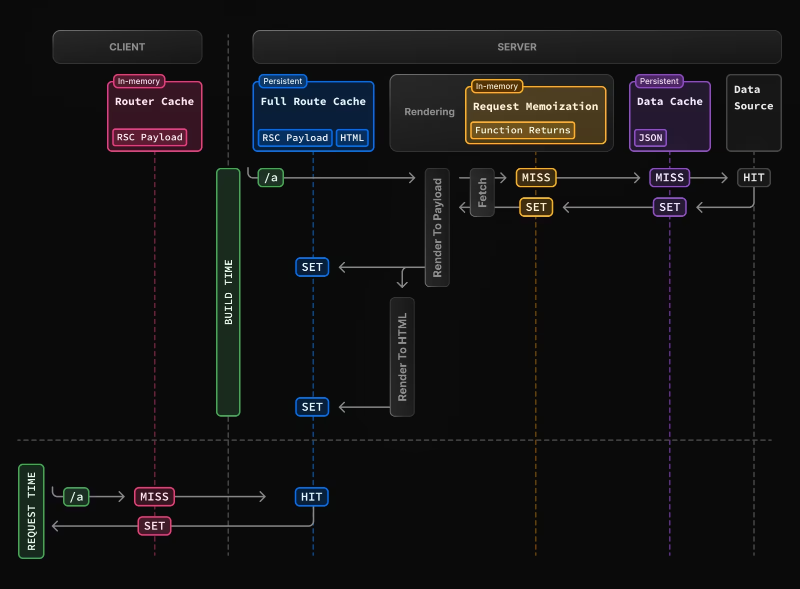
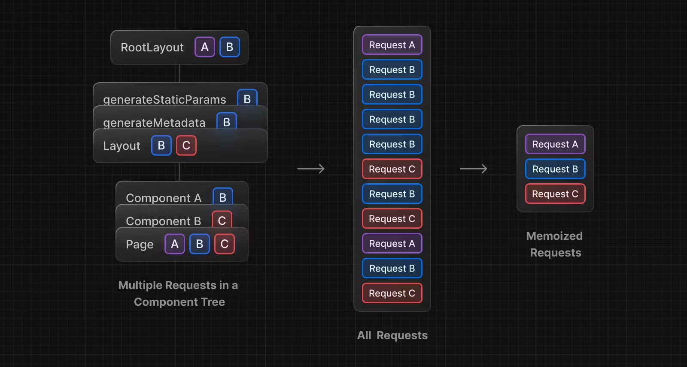
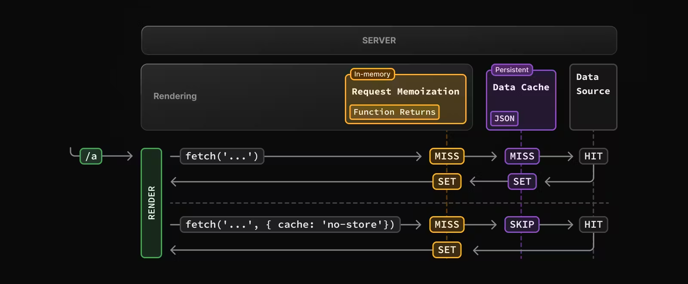

# cache

https://nextjs.org/docs/app/building-your-application/caching

- 넥스트는 **렌더링**과 **데이터 요청**을 캐싱함으로써 최적화
- By default, Next.js will cache as much as possible to improve performance and reduce cost.
  근데 캐싱 비용은 고려 안해?
- 캐싱을 이해하는 것은 넥스트를 잘 활용하는 데 필수적이지 않은데, 이는 넥스트가 별도의 설정 없이도 사용하는 API에 따라 최적의 퍼포먼스를 제공하기 때문이다

# 캐싱 매커니즘 - 4가지

## Router Cache

다이어그램 설명

request time

- 일정 시간(5분)이 지나면 무효화
- 단 라우트 캐시는 클라이언트에 보관되므로 새로고침하면 없어짐
- 즉 SET이 된것도 새로고침하면 없어짐
- 모든 캐시 시스템은 라우트 캐시로 시작됨
- 따라서 예를 들어 데이터 케시를 무력화하기 위해 옵션을 써도
- 라우트 캐시 때문에 의도한대로 코드가 동장을 안할 수도 있음
- 예를 들어, 더 깊이 들어가기 전에 라우트 캐시 계층 수준에서만 왔다갔다하는 경우

- 풀라우트 캐시와 보완 관계

- in-memory, RSC payload
- MISS - 라우트 캐싱하지 않음
- HIT - 풀라우트 캐싱하지 않음
- PARTIAL HIT - 풀라우트 캐싱하지 않음

### 라우트 캐시 무효화 방법 - 3가지

- revalidatePath
- rev

## Full Route Cache

- 서버에서 보다 안정적으로 더 오래 보관

### Full Route Cache vs Router Cache

- 라우터 캐시는 유저 세션이 유지되는 동안 브라우저에 일시적으로 RSC 페이로드를 보관하고
- 풀 라우터 캐시는 여러번의 유저 요청에 걸쳐 더 오랫동안 RSC 페이로드와 HTML을 서버에 보관

- 풀 라우터 캐시가 정적으로 렌더링된 라우트만 캐싱하는데 반해,
- 라우터 캐시는 정적 및 동적으로 렌더링된 라우트 모두에 적용된다

- 정적 렌더링: 라우트가 빌드타임에 렌더링되는 것
- 동적 렌더링: 라우트가 요청되는 시점에 각 유저에게 렌더링되는 것

## Request Memoization

- 하나의 렌더링에서 동일한 api 콜을 기억해서 캐시하는 것
- 하나의 렌더링이 끝나면 초기화
- 즉, 하나의 페이지가 렌더링되는 과정에서만 유효
- 예를 들어, 하나의 페이지 렌더링에 동적으로 여러개의 데이터 받아올 경우

## Data Cache

- 데이터 캐시에 저장된 데이터는 배포 동안 지속되기 때문에 그 이후 요청하면 무조건 데이터 캐싱된 데이터가 응답된다.
- 이를 무력화하기 위해서는 요청을 보낼 때 fetch의 두번째 인자로 `{cache: 'no-store'}`를 보내야한다.
- 여기서 **SKIP**은 말그대로 데이터를 초기화하는 것이 아니라, 건너뛰는 것 (무력화보단 우회에 가깝)
- 따라서, 옵션을 없애면 원래대로 다시 받아서 가져옴
- 넥스트에서 구현한 fetch에 이미 존재하는 `no-store`를 써야한다.(no-cache 아님 주의)
- 캐시 옵션은 *컴포넌트*에 종속되는 것이 아니라, *요청*에 종속

- revalidation은 다시 원천소스에 요청해서 새로 데이터를 저장
- 즉, 갱신의 개념
- 따라서 효율적인 측면에서 no-store 보다 낫다고 할 수 있다
- 목적에 따라 맞게 쓰면됨
- 실시간 업데이트가 중요한 경우 no-store 사용
- 좋아요, 구독자수는 revalidate 사용

### 무력화 방법

1. By opting-out : `{cache: 'no-store'}` 캐시 옵션 사용
2. Revalidating : Time-based Revalidation, On-demand Revalidation

#### Revalidating

Time-based Revalidation

- 일정 시간이 지나고 새로운 요청이 전송되었을 때
-

On-demand Revalidation

# 캐싱 설정 API

# 캐싱 간 관계

- 나중에 서버 액션을 이해하는 데 캐싱시스템 중요
- 쿼리 빌더 패키지들도 보통 자체 캐싱시스템을 가지고 있음
- 둘다 쓸 경우 캐싱 디버깅이 힘들기 때문에 캐싱을 철저하게 관리할 능력이 안되면 쓰지 않는 것을 권장

- 넥스트의 fetch는 리액트의 fetch와 다름
- 넥스트는 자신들의 캐싱시스템에 맞게 fetch 기능 확장
- 따라서 axios를 쓰면 넥스트가 구현한 최적화를 활용할 수 없다

# 캐시 무력화기법

케이스 1 - revalidate

사용예시

- 유튜브 구독자 수를 실시간으로 업데이트할 필요 없음. 이 경우 revalidate 값을 3600 \* 24처럼 설정하여 24시간마다 업데이트되도록 설정할 수 있음
-

revalidatePath

- 무력화할 경로를 지정해줘야하는 단점 존재

revalidateTag

- 무력화하

## 서버액션에서 무력화할 수 있는 시스템

