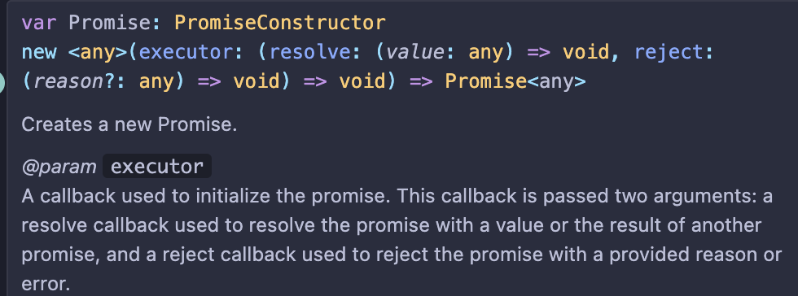

# 프로미스

- 자바스크립트에서 **비동기 처리**를 위해 제공하는 객체
- 따라서

1. state
   - pending (대기)
   - fulfilled (이행) / rejected (거부)
2. producer & consumer

# 프로미스 생성

## 프로미스 생성자함수 매개변수



- executor 콜백함수
  - resolve 콜백함수, reject 콜백함수

```js
const promise = new Promise((resolve, reject) => {
  // doing some heavy work (network, read files)
  console.log("doing something");
});
```

- 프로미스가 생성되는 순간 네트워크 통신을 수행함
- 따라서, 사용자가 아무 인터렉션을 하지 않았는데 실행되지 않도록 주의

1. state

- pending: 프로미스 객체가 생성되었을 떄
- fulfilled: resole 함수가 호출되었을 떄

- resole - then 호출
- reject - catch 호출

```js
const promise = new Promise((resolve, reject) => {
  setTimeout(() => {
    resolve("Done");
  }, 2000);
});

promise
  .then((done) => {
    console.log("task1", done);
  })
  .catch(() => {
    console.log("error");
  });
```

- promise 내부에서 resolve 함수가 호출되어야지만 pending에서 fulfilled로 상태가 바뀌고 then 함수를 호출

```js
const promise = new Promise((resolve, reject) => {
  setTimeout(() => {
    reject(new Error("no network"));
  }, 2000);
});

promise
  .then((done) => {
    console.log("task1", done);
  })
  .catch((err) => {
    console.log(err);
  })
  .finally(() => {
    console.log("final!");
  });
```

- 문법적으로 제공하는 것은 then, catch, finally이지만
  실질적으로 많이 사용하는 것은 then, catch

# 콜백헬 -> 프로미스로 바꿔보기

```js
// 콜백헬

function task1(callback) {
  console.log("task1");
  callback();
}
function task2(callback) {
  setTimeout(() => {
    console.log("task2");
    callback();
  }, 1000);
}
function task3(callback) {
  console.log("task3");
  callback();
}
function task4(callback) {
  console.log("task4");
  callback();
}

task1(() =>
  task2(() => {
    task3(() => {
      task4(() => {
        console.log("task all done");
      });
    });
  })
);

// 프로미스
// task1을 호출하게 되면 프로미스가 생성됨
function task1() {
  return new Promise((resolve) => {
    console.log("task1");
    resolve();
  });
}
function task2() {
  return new Promise((resolve) => {
    setTimeout(() => {
      console.log("task2");
      resolve();
    }, 1000);
  });
}
function task3() {
  return new Promise((resolve) => {
    console.log("task3");
    resolve();
  });
}
function task4() {
  return new Promise((resolve) => {
    console.log("task4");
    resolve();
  });
}

// task1().then(() => {
//   console.log("task1 done");
//   task2().then(() => {
//     console.log("task2 done");
//     task3().then(() => {
//       console.log("task4 done");
//       console.log("done");
//     });
//   });
// });

// 메서드 체이닝
task1()
  .then(() => task2())
  .then(() => task3())
  .then(() => task4())
  .then(() => console.log("done"));
```

- 콜백이 아닌 프로미스를 쓰는 이유는 가독성
- 콜백도 필요한 기능들을 제공하며 프로미스가 기능적으로 더 뛰어난 것은 아님

# 프로미스 에러 처리

- 프로미스 내 reject 호출하고, 함수 호출할 때 catch 호출

```js
function task1() {
  return new Promise((resolve) => {
    console.log("task1");
    resolve();
  });
}
function task2() {
  return new Promise((resolve, reject) => {
    setTimeout(() => {
      console.log("task2");
      // resolve();
      reject();
    }, 1000);
  });
}
function task3() {
  return new Promise((resolve) => {
    console.log("task3");
    resolve();
  });
}
function task4() {
  return new Promise((resolve) => {
    console.log("task4");
    resolve();
  });
}

task1()
  .then(() => task2())
  .then(() => task3())
  .then(() => task4())
  .then(() => console.log("done"))
  .catch((err) => {
    console.error(err);
  });
```

- 에러가 발생해도 계속해서 코드를 실행하고 싶을 경우,
- 에러가 발생한 것 같은 위치 다음에 catch함수 옮길 수 있음

```js
task1()
  .then(() => task2())
  .catch((err) => {
    console.error(err);
  .then(() => task3())
  .then(() => task4())
  .then(() => console.log("done"))
  });
```
