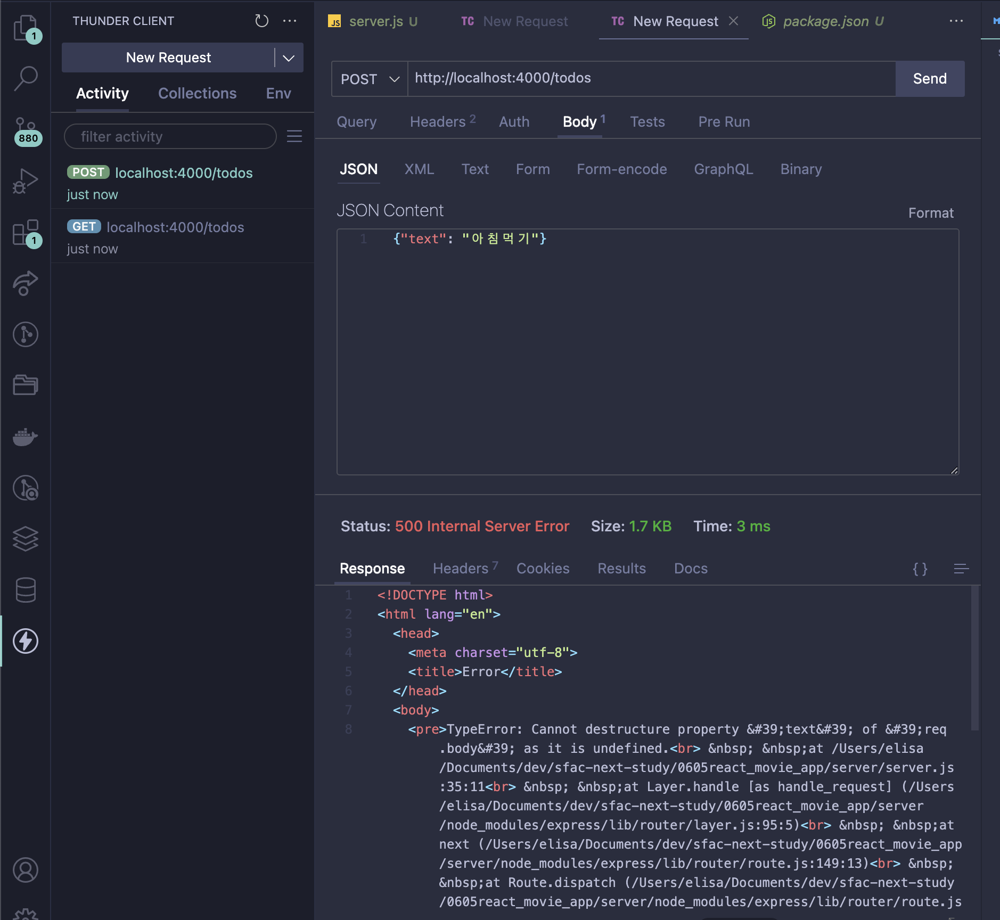

server 폴더 생성
초기화 npm init -y
npm i express nodemon uuid 패키지 설치
server.js 파일 생성
express hello world 예제 복붙
port 4000으로 변경
url로 접속하여 확인해보기
http://localhost:4000/

npx nodemon - 자동 업데이트
npx nodemon server.js - 한번만 업데이트. 수정할 때마다 다시 실행해야됨.

# thunder client 사용하여 확인해보기

// get, post, delete, patch

https://expressjs.com/en/guide/using-middleware.html
app.use(bodyParser.json())

https://www.npmjs.com/package/uuid
const { v4: uuidv4 } = require('uuid');

# data fetching

1. fetch

- then 두번
- async, await

2. axios
   https://www.npmjs.com/package/axios
   라이브러리 설치
   예제 코드 복붙

## fetch vs axios

- 둘다 httpRequest 를 만드는 것은 똑같다
- fetch는 내장이고m, axios는 라이브러리이기 때문에 더 넓은 범위에서 사용 가능
- 지금은 fetch도 거의 다 지원하기 때문에 큰 차이는 없음
- axios가 코드가 더 간결

더미 데이터
https://jsonplaceholder.typicode.com/
