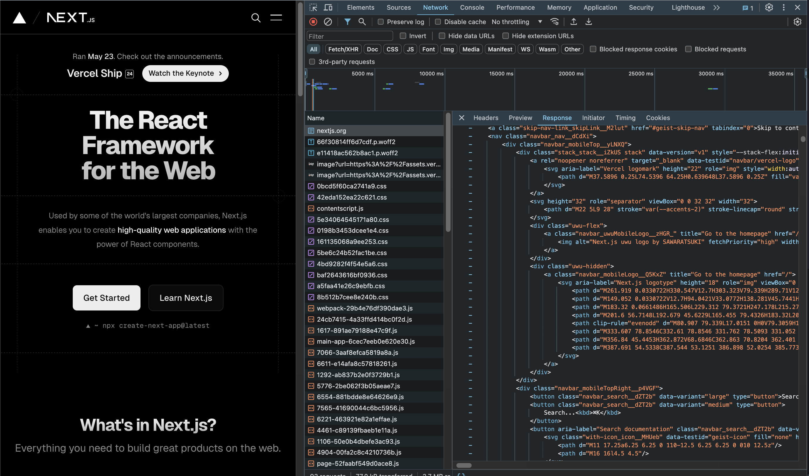

개발 서버 구동
서버가 index.html 파일을 파싱하며 순차적으로 읽어드린 후 스크립트 태그를 만나면 해당하는 파일 실행

리액트가 처음 불러오는 html
자바스크립트 막고 새로고침해보고 다시 보기
html은 파싱되나 js에서 막혀서 렌더링이 안되는 것을 알 수 있음

넥스트 사이트랑 비교
이미 모든 코드가 적혀있음
js막고 새로고침 해봐도 정상적으로 화면 보임
SEO

넥스트 렌더링 (2번) 1.서버에서 렌더링 2.사용자 인터렉션을 통한 hydration

# 라이브러리 vs 프레임워크

React - Library
Next.js - Framework

Vue.js - Framework
Nuxt.js - Framework

- 라이브러리는 우리가 코드를 가져다 쓴다면
- 프레임워크는 프레임워크가 우리가 규칙에 맞게 쓴 코드를 가져다 쓰는 개념

- vite를 사용해서 초기 프로젝트를 구성할 경우 리액트가 프레임워크처럼 느껴질 수 있음
