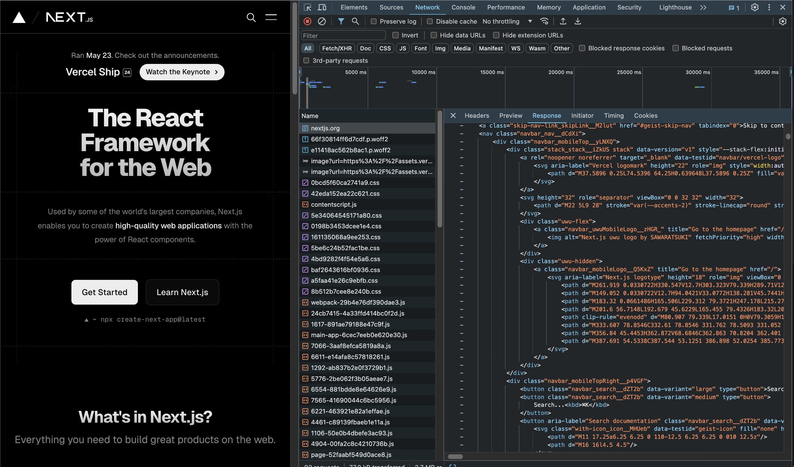
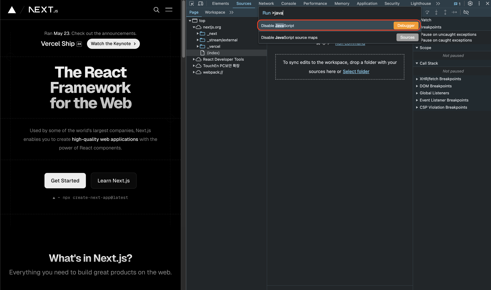
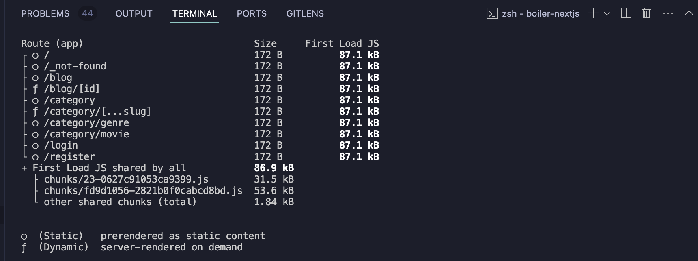

# 서버 컴포넌트 / SSR

- 화면에 보이기 전에 실행되는 컴포넌트
- 넥스트에선 모든 컴포넌트는 디폴트로 서버 컴포넌트

- 즉, 'use client;'이라도 1차적으로 SSR이 일어남

# 클라이언트 컴포넌트 / CSR

- 웹 브라우저에 코드가 불러와지고 실행되는 컴포넌트
- 사용자 인터렉션이 발생하는 부분은 무조건 클라이언트 컴포넌트로 만들어야
- 친절하게도 넥스트가 자동으로 인식하여 지정해줌

- 클라이언트 컴포넌트라고 해서 클라이언트에서만 확인 가능한 것은 아님
- 클라이언트 컴포넌트도 1차적으로 서버에서 실행이 되고, **사용자 인터렉션이 발생한 부분**만 클라이언트에서 실행

# 넥스트 렌더링

- 넥스트는 렌더링이 2번 일어남
- 1차 렌더링: SSR
- 2차 렌더링: CSR

  - hydration: 원래 화면에 CSR로 완성된 결과물을 붙여주는 것

- 넥스트로 빌드된 넥스트 사이트에 들어가서 네트워크 창을 들여다보면
  
- 위처럼 이미 완성된 html을 볼 수 있다.
  
- 따라서, 위처럼 disable javascript를 설정을 해도 문제 없이 사이트를 볼 수 있다.
- 마찬가지로 새로고침을 여러번 해보면 깜빡임 없이 렌더링 됨 (별도의 사용자 인터렉션 없을 경우) ->완성된 Html을 받아서 바로 렌더링하기 때문에

- 반면에 리액트 사이트에서 같은 동작을 해보면?

# 렌더링 참고

`npm run build`

- ssg로 정적인 페이지 빌드
